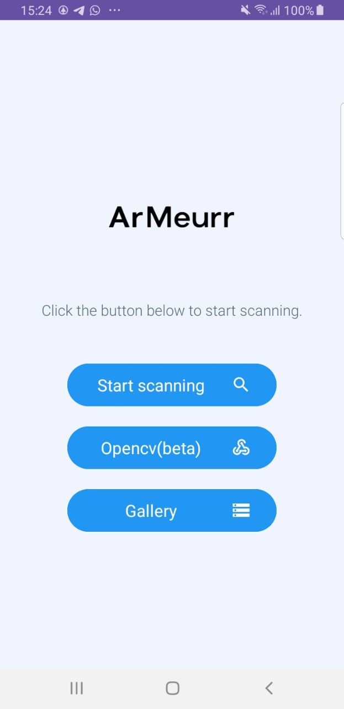
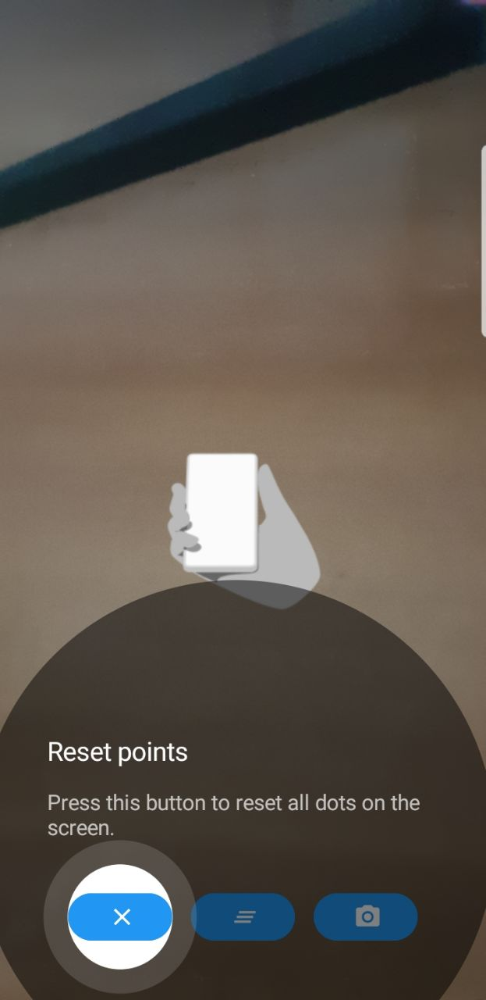
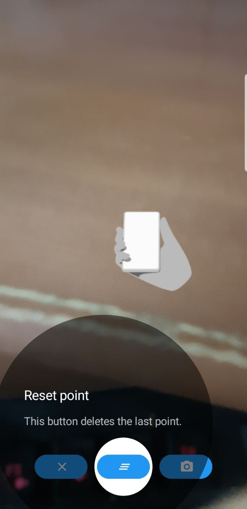
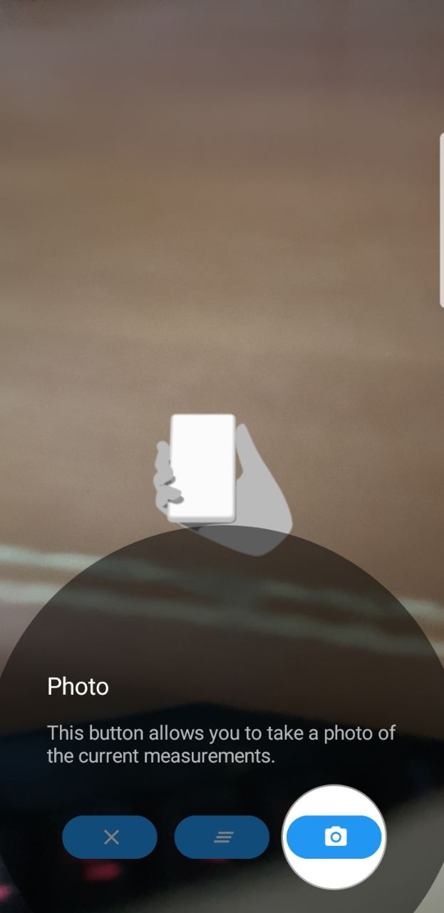
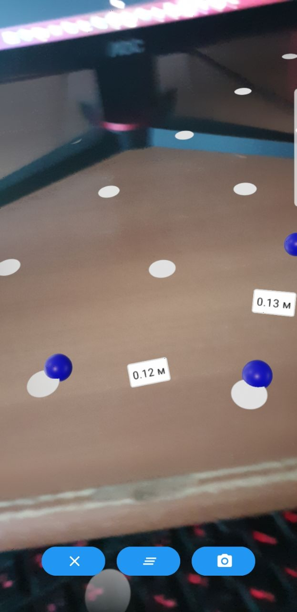
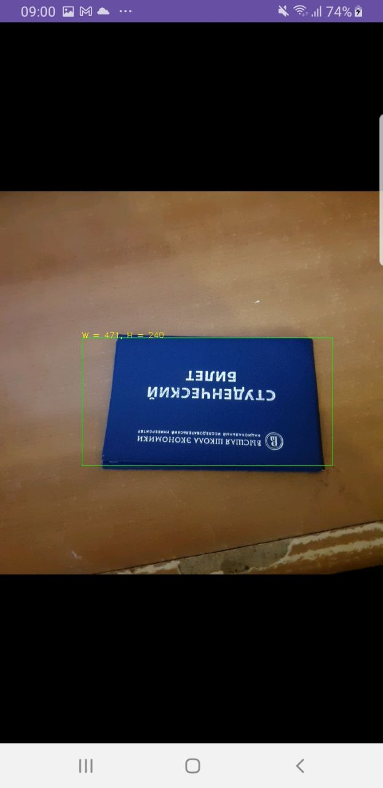
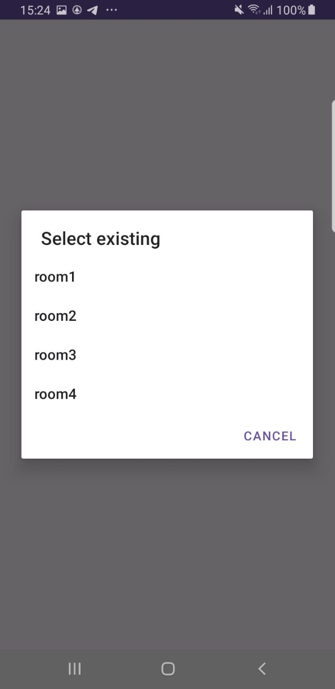
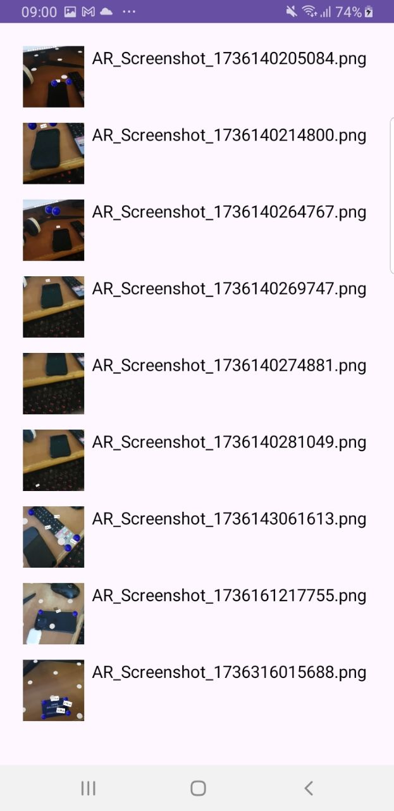

# Coursework3

## Technologies
1. ARCore
2. Glide(для изображений)
3. Material Tap Target Prompt(для интерактивных подсказок)
4. OpenCV

## StartActivity

## ProjectActivity

## MainActivity

## Opencv

## Gallery

